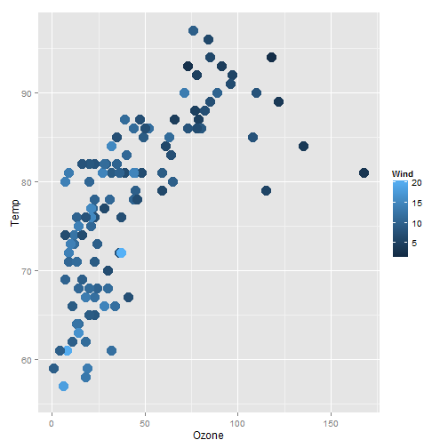

Air Quality Dataset Analysis
========================================================
author: Mathew Bramson
date: September 27, 2015

Synposis
========================================================

This applications allows the user to explore the Air Quality Dataset from the datasets package.

Capabilities

- Plotting
- Linear Regression Modeling
- Model Predictor Selection

The Dataset
========================================================


```r
data(airquality)
str(airquality)
```

```
'data.frame':	153 obs. of  6 variables:
 $ Ozone  : int  41 36 12 18 NA 28 23 19 8 NA ...
 $ Solar.R: int  190 118 149 313 NA NA 299 99 19 194 ...
 $ Wind   : num  7.4 8 12.6 11.5 14.3 14.9 8.6 13.8 20.1 8.6 ...
 $ Temp   : int  67 72 74 62 56 66 65 59 61 69 ...
 $ Month  : int  5 5 5 5 5 5 5 5 5 5 ...
 $ Day    : int  1 2 3 4 5 6 7 8 9 10 ...
```

Plotting Example
========================================================

 

Linear Regression Example
========================================================

```

Call:
lm(formula = .outcome ~ ., data = dat)

Residuals:
    Min      1Q  Median      3Q     Max 
-37.014 -12.284  -3.302   8.454  95.348 

Coefficients:
             Estimate Std. Error t value Pr(>|t|)    
(Intercept) -64.11632   23.48249  -2.730  0.00742 ** 
Solar.R       0.05027    0.02342   2.147  0.03411 *  
Wind         -3.31844    0.64451  -5.149 1.23e-06 ***
Temp          1.89579    0.27389   6.922 3.66e-10 ***
Month        -3.03996    1.51346  -2.009  0.04714 *  
Day           0.27388    0.22967   1.192  0.23576    
---
Signif. codes:  0 '***' 0.001 '**' 0.01 '*' 0.05 '.' 0.1 ' ' 1

Residual standard error: 20.86 on 105 degrees of freedom
Multiple R-squared:  0.6249,	Adjusted R-squared:  0.6071 
F-statistic: 34.99 on 5 and 105 DF,  p-value: < 2.2e-16
```
